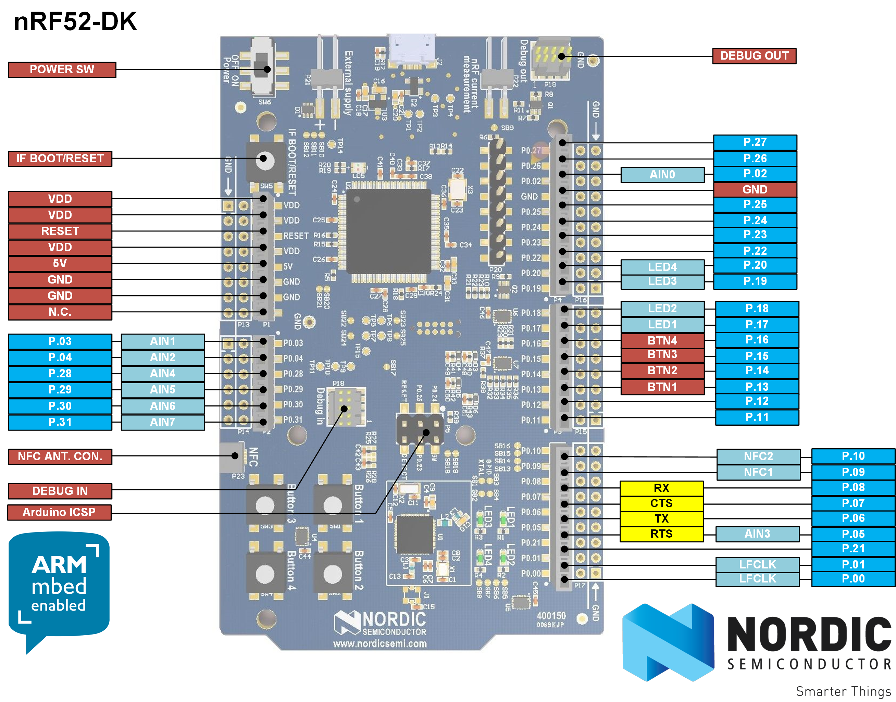

# Nrf52832 examples Using NRF52832 Keil Pack 
nrf52832 peripheral examples using MDK5 Software Packs - Keil

### Usage
* install nRF_DeviceFamilyPack version 8.27.1 & other nrf52832 keil pack.

### Keil Options :
**Target**: 
- `Code Generation` -> `Arm Compiler` : `Use default compiler version 5`
- `Read/Write Memory Areas` -> Disable `IRAM2`

**Output:**
- Enable : `Create Hex File`

**C/C++:**
- `Define` : `NRF52 BOARD_PCA10040`
- `Misc Controls` : `--c99`

**Debug:**
- Select Use : `J-LINK/ J-TRACE Cortex`
- Open `Settings`:
	- `Debug` -> Select Port: `SW`
	- `Flash Download` -> Enable `Reset and Run`
